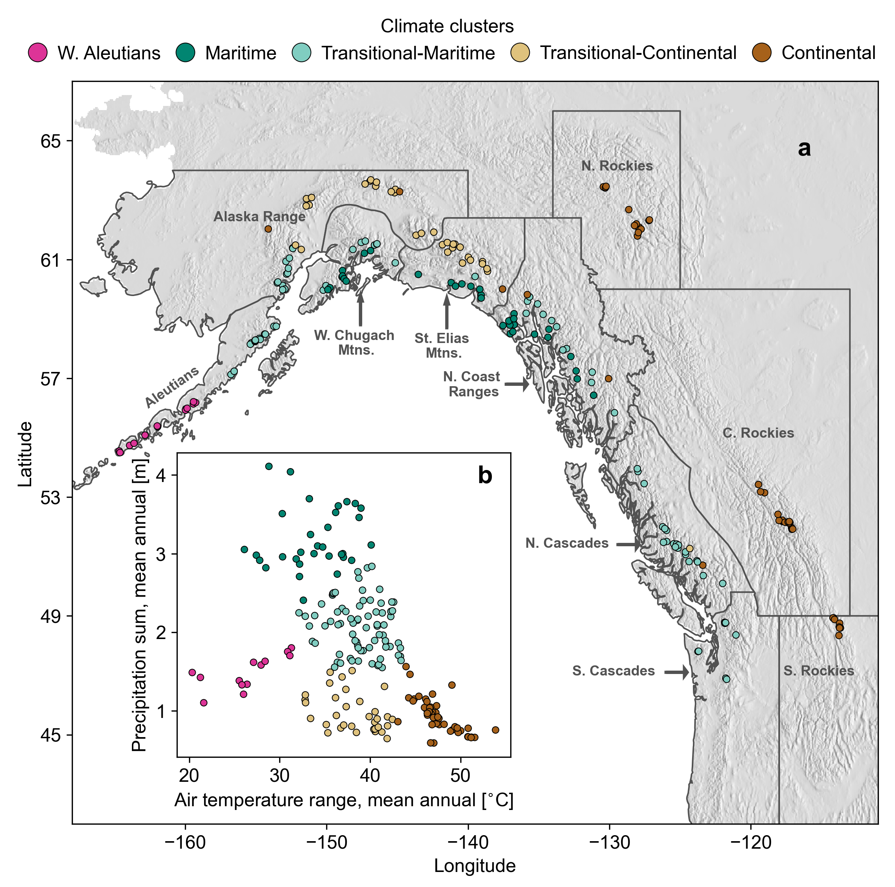
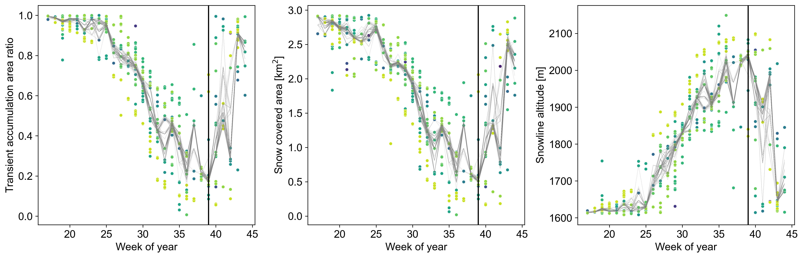
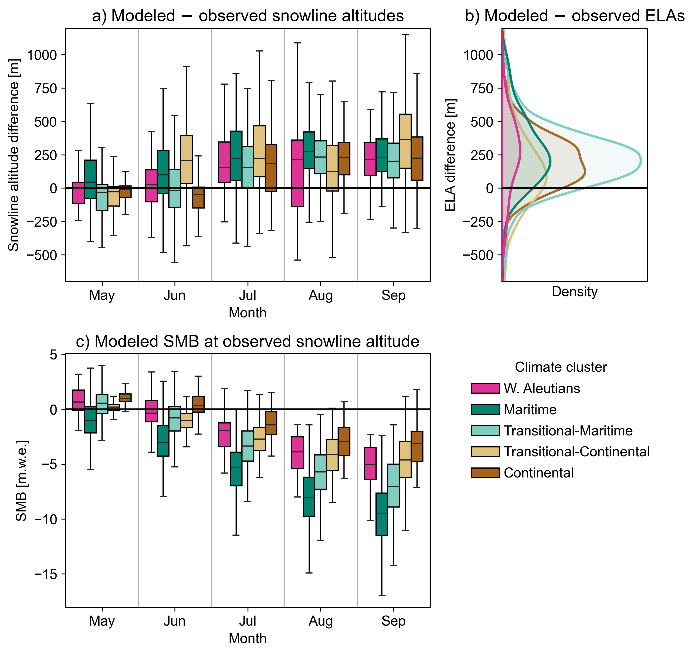

# `glacier-snow-cover-analysis`

Rainey Aberle and Ellyn M. Enderlin

[CryoGARS Glaciology](https://github.com/CryoGARS-Glaciology)

Tools and notebooks used to analyze snow cover outputs from the [`glacier-snow-cover-mapping`](https://github.com/RaineyAbe/glacier-snow-cover-mapping) package1,2 for 200 glaciers in western North America.

## Correspondence
Rainey Aberle: raineyaberle@u.boisestate.edu

## Installation
See the `environment.yml` file for required packages. To install the environment using [Mamba](https://mamba.readthedocs.io/en/latest/index.html) or [Conda](https://anaconda.org/anaconda/conda), run the following:

`mamba env create -f environment.yml`

All required packages will be installed in an environment called "gsca_env".

## General workflow:
0. Apply the `glacier-snow-cover-mapping` workflow to several glaciers of choice. Save the snow cover statistics and glacier outlines.  

1. Download ERA5-Land3 Daily Aggregated time series averaged over glacier areas (`notebooks/1_ERA5-Land_download_process.ipynb`). This notebook requires a Google Earth Engine account, which you can sign up for [here](https://earthengine.google.com/signup/).

2. Develop climate clusters to categorize the sites based on local climate conditions from ERA5-Land using K-Means clustering (`notebooks/2_develop_climate_cluster.ipynb`). Default predictors are the mean annual air temperature range and precipitation sum. Figure 1 shows an example output after clustering the study sites and assigning names to each cluster. 

 

*Figure 1. Climate clusters developed for the study sites using mean annual precipitation range and precipitation sums for 2013–2023 using ERA5-Land time series at each site and K-Means clustering. a) Map view of the study site locations. Background image is a shaded relief constructed using the GTOPO digital elevation model courtesy fo the U.S. Geological Survey. Glacier region boundaries are from the Randolph Glacier Inventory v. 64. b) Distribution of the input climate varibales and resulting clusters at each site.*

3. Calculate the weekly median trends at each site for the observed study period (`notebooks/3_calculate_weekly_median_trends`). In other words, stack all years and estimate median transient accumulation area ratios (AARs), snow-covered areas (SCAs), and snowline altitudes for each week of the melt season using Monte Carlo sampling simulations. Weekly median trends may be used to assess typical minimum snow cover extent and timing over the observed time period. Figure 2 shows an example of the sampling simulations for snow cover statistics at South Cascade Glacier, WA (RGI ID: 2.18778).

 

*Figure 2. Stacked weekly time series of the transient accumulation area ratio, snow-covered area, and snowline altitude. Points indicate observations colored by year, with lighter colors indicating more recent dates (2013–2023). Gray lines indicate the 100 Monte Carlo simulations, with 80% of observations randomly sampled from each week in each simulation. The black line indicates the median minimum snow cover timing across all simulations.*

4. Compare snow cover time series to global glacier model outputs from Rounce et al. (2023)5 (`notebooks/4_modeled_vs_remote_SMB.ipynb`). Here, we compared observed and modeled glacier snowline altitudes and equilibrium line altitudes, and adjusted modeled degree-day factors of snow, which are used to convert air temperatures to surface melt in the surface mass balance model (PyGEM5). Figure 3 shows the results from the comparison at our study sites. 

 

*Figure 3. Comparison of modeled and observed a) snowline altitudes, b) equilibrium line altitudes (ELAs), and c) surface mass balance (SMB) at the observed snowline altitudes.*

5. Make figures for presentations and manuscript (`notebooks/5_make_figures.ipynb`).  

## References
1. Aberle, R., Enderlin, E. M., & Liu, J. (2024). RaineyAbe/glacier-snow-cover-mapping: Second release (v0.2). Zenodo. https://doi.org/10.5281/zenodo.10616385

2. Aberle, R., Enderlin, E. M., O’Neel, S., Florentine, C., Sass, L., Dickson, A., et al. (2024). Automated snow cover detection on mountain glaciers using space-borne imagery. EGUsphere, 1–28. https://doi.org/10.5194/egusphere-2024-548

3. Muñoz Sabater, J. (2019). ERA5-Land monthly averaged data from 1950 to present [Data set]. Copernicus Climate Change Service (C3S) Climate Data Store (CDS). https://doi.org/10.24381/cds.68d2bb30

4. RGI Consortium. (2017). Randolph Glacier Inventory - A Dataset of Global Glacier Outlines, Version 6. Boulder, Colorado USA. NSIDC: National Snow and Ice Data Center. Retrieved from https://doi.org/10.7265/4m1f-gd79

5. Rounce, D. R., Hock, R., Maussion, F., Hugonnet, R., Kochtitzky, W., Huss, M., et al. (2023). Global glacier change in the 21st century: Every increase in temperature matters. Science, 379(6627), 78–83. https://doi.org/10.1126/science.abo1324

## Funding and acknowledgements
This work was supported by the SMART Scholarship, the Idaho Space Grant Consortium, and NASA EPSCoR award 80NSSC20M0222. Thank you to David Rounce for his assistance with accessing and analyzing the glacier model outputs, and to members of the CryoGARS lab for their support and input throughout this project. 