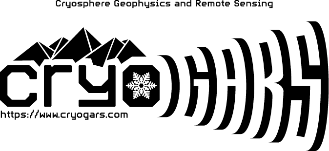

# `glacier-snow-cover-analysis`

Rainey Aberle and Ellyn M. Enderlin

[CryoGARS Glaciology](https://github.com/CryoGARS-Glaciology)

Tools and notebooks used to analyze snow cover outputs from the [`glacier-snow-cover-mapping`](https://github.com/RaineyAbe/glacier-snow-cover-mapping) package$^{1,2}$ for 200 glaciers in western North America.

## Correspondence
Rainey Aberle: raineyaberle@u.boisestate.edu

## Installation
See the `environment.yml` file for required packages. To install the environment using `mamba` or `conda`, run the following:

`mamba env create -f environment.yml`

All required packages will be installed in an environment called "gsca_env".

## General analysis workflow:
0. Apply the `glacier-snow-cover-mapping` workflow to several glaciers of choice. Save the snow cover statistics and glacier outlines.  

1. Download ERA5-Land$^3$ Daily Aggregated time series averaged over glacier areas (`notebooks/1_ERA5-Land_download_process.ipynb`). This notebook requires a Google Earth Engine account, which you can sign up for [here](https://earthengine.google.com/signup/).

2. Develop climate clusters to categorize the sites based on local climate conditions from ERA5-Land using K-Means clustering (`notebooks/2_develop_climate_cluster.ipynb`). Default predictors are the mean annual air temperature range and precipitation sum.

3. Calculate the weekly median trends at each site for the observed study period (`notebooks/3_calculate_weekly_median_trends`). In other words, stack all years and estimate median transient accumulation area ratios (AARs), snow-covered areas (SCAs), and snowline altitudes for each week of the melt season using Monte Carlo sampling simulations. Weekly median trends may be used to assess typical minimum snow cover extent and timing over the observed time period. 

4. Compare snow cover time series to global glacier model outputs from Rounce et al. (2023)$^4$ (`notebooks/4_modeled_vs_remote_SMB.ipynb`). Here, we compared the 

5. Make figures for presentations and manuscript (`notebooks/5_make_figures.ipynb`). Here, we compared observed and modeled glacier snowline altitudes and equilibrium line altitudes, and adjusted modeled degree-day factors of snow, which are used to convert air temperatures to surface melt in the surface mass balance model (PyGEM$^4$). 

## References
1. Aberle, R., Enderlin, E. M., & Liu, J. (2024). RaineyAbe/glacier-snow-cover-mapping: Second release (v0.2). Zenodo. https://doi.org/10.5281/zenodo.10616385

2. Aberle, R., Enderlin, E. M., O’Neel, S., Florentine, C., Sass, L., Dickson, A., et al. (2024). Automated snow cover detection on mountain glaciers using space-borne imagery. EGUsphere, 1–28. https://doi.org/10.5194/egusphere-2024-548

3. Muñoz Sabater, J. (2019). ERA5-Land monthly averaged data from 1950 to present [Data set]. Copernicus Climate Change Service (C3S) Climate Data Store (CDS). https://doi.org/10.24381/cds.68d2bb30

4. Rounce, D. R., Hock, R., Maussion, F., Hugonnet, R., Kochtitzky, W., Huss, M., et al. (2023). Global glacier change in the 21st century: Every increase in temperature matters. Science, 379(6627), 78–83. https://doi.org/10.1126/science.abo1324
